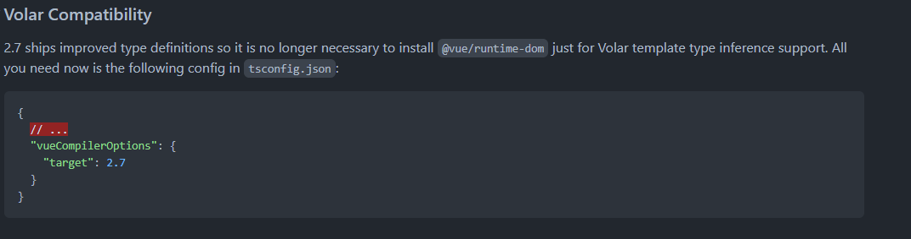

# Vue 2.7 + Vite
> vue2.7 + vue-router3 + pinia
> 示例代码: https://github.com/klren0312/vite_vue2.7
> 示例页面: https://klren0312.github.io/vite_vue2.7/

## 用到的vite插件

 - @vitejs/plugin-vue2 vite的vue2.7插件
 - @vitejs/plugin-legacy 打包支持IE
 - unplugin-vue-components 按需引入插件


## 相关配置

### 1. vscode的vetur插件适配
>参考资料: https://github.com/vuejs/vetur/issues/2296#issuecomment-1155957974

需要在根目录创建`vetur.config.js`

```js
// vetur.config.js
module.exports = {
  settings: {
    'vetur.completion.autoImport': false,
    'vetur.experimental.templateInterpolationService': false,
    'vetur.validation.interpolation': false,
    'vetur.validation.template': false,
    'vetur.validation.templateProps': false,
    'vetur.validation.style': false,
    'vetur.validation.script': false,
    'vetur.format.enable': false,
    'vetur.ignoreProjectWarning': true,
    'vetur.languageFeatures.codeActions': false,
    'vetur.languageFeatures.semanticTokens': false,
    'vetur.languageFeatures.updateImportOnFileMove': false,
    'vetur.trace.server': 'off',
    'vetur.underline.refValue': false,
  },
}
```

或者改用`volar`插件


### 2. vite适配vue2.7
> 参考资料: https://github.com/vuejs/vue/blob/main/CHANGELOG.md#vue-cli--webpack

使用官方的[`@vitejs/plugin-vue2`插件](https://github.com/vitejs/vite-plugin-vue2)

vite创建vue项目后, 把插件替换下就行了

### 3. vue-router安装
>vue2只支持vue-router3版本

若需要在页面中使用$route和$router, 可以在路由文件中新增两个方法

```js
export function useRouter() {
  return router
}

export function useRoute() {
  return router.currentRoute
}
```

### 4. pinia安装
> 按官方文档引入即可: https://pinia.vuejs.org/getting-started.html#installation

```js
import { createPinia, PiniaVuePlugin } from 'pinia'

Vue.use(PiniaVuePlugin)
const pinia = createPinia()

new Vue({
  el: '#app',
  // other options...
  // ...
  // note the same `pinia` instance can be used across multiple Vue apps on
  // the same page
  pinia,
})
```

### 5. element-ui按需引入
使用[`unplugin-vue-components`插件](https://github.com/antfu/unplugin-vue-components)

- 💚 Vue 2 和 Vue 3 开箱即用
- ✨ 支持组件和指令.
- ⚡️ 支持 Vite, Webpack, Vue CLI, Rollup, esbuild 等打包工具, powered by <a href="https://github.com/unjs/unplugin">unplugin</a>.
- 🏝 Tree-shakable,只注册引用的组件.
- 🪐 文件夹名称作为命名空间.
- 🦾 ts支持.
- 🌈 [内置解析器](#importing-from-ui-libraries) 支持主流的UI库.
- 😃 对 [unplugin-icons](https://github.com/antfu/unplugin-icons)支持友好.

使用方法(element-ui为例):

```js
import Components from 'unplugin-vue-components/vite'
import { ElementUiResolver } from 'unplugin-vue-components/resolvers'
export default defineConfig({
  plugins: [
    Components({
      resolvers: [ElementUiResolver()],
    }),
  ],
})
```

### 6. 打包后支持ie11
使用[`@vitejs/plugin-legacy`插件](https://github.com/vitejs/vite/blob/main/packages/plugin-legacy/README.md)

```js
import legacy from '@vitejs/plugin-legacy'
export default defineConfig({
  plugins: [
    legacy({
      targets: ['defaults', 'not ie < 9'],
    }),
  ],
})
```

### 7. 分离打包
> 参考资料: https://cn.vitejs.dev/guide/build.html#chunking-strategy

```js
import { splitVendorChunkPlugin } from 'vite'
export default defineConfig({
  plugins: [
    splitVendorChunkPlugin(),
  ],
  build: {
    rollupOptions: {
      output: {
        manualChunks: {
          'element-ui': ['element-ui'],
        },
      },
    },
  },
})
```


